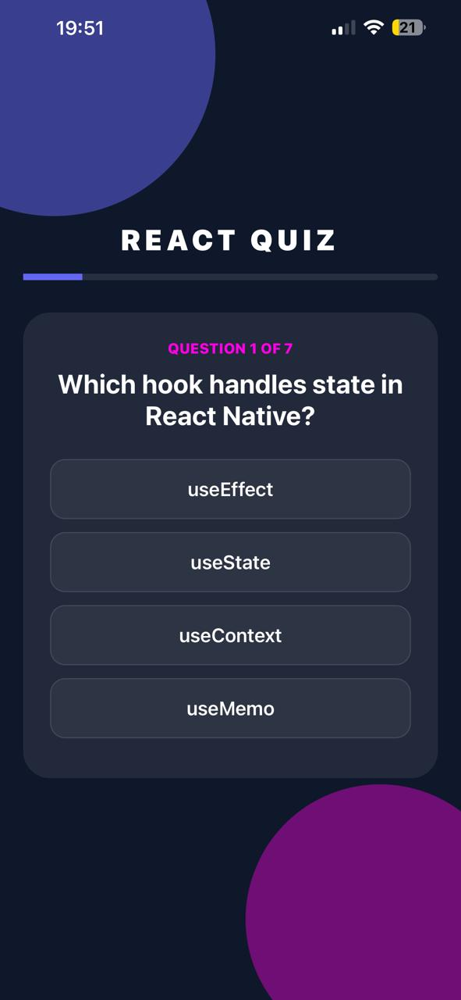
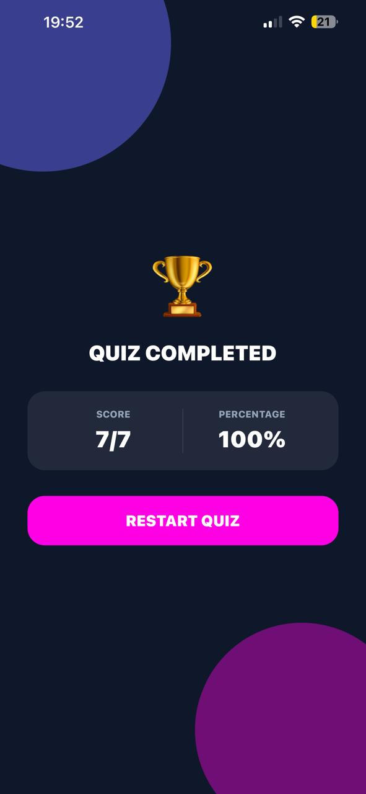

# React Quiz App 📱

## 📌 Project Overview

This project is an **Interactive Quiz Application** built using **React Native (Expo)** as part of the **Mobile Application Development** course.

The app allows users to answer multiple-choice questions, tracks their score, displays progress, and shows a results screen at the end of the quiz.

---

### 🎯 Features

-   ✅ 7 multiple-choice quiz questions
-   ✅ Questions stored using **arrays of objects**
-   ✅ State management with `useState`
-   ✅ Score tracking throughout the quiz
-   ✅ Progress bar indicator
-   ✅ Results screen with score and percentage
-   ✅ Restart quiz functionality
-   ✅ Custom modern UI styling (dark/neon theme)

---

### 🧠 Concepts Used

This project demonstrates the following core concepts covered in class:

-   Arrays of Objects
-   Tracking position in arrays
-   State management with React Hooks
-   Conditional rendering (multiple UI states)
-   Rendering lists using `.map()`
-   Early return pattern for results screen

---

### 🛠️ Technologies Used

-   React Native
-   Expo
-   JavaScript (ES6)
-   React Hooks (`useState`)

---

### 📱 App Screens

-   Quiz screen with progress bar
-   Multiple-choice question interface
-   Results screen with score and percentage
-   Restart button to replay the quiz

---

### 🚀 How to Run the Project

1.  Clone the repository
    
2.  Install dependencies:
    
    ```bash
    npm install
    ```
    
3.  Start the project:
    
    ```bash
    npx expo start
    ```
    
4.  Run on a physical device using Expo Go or on an emulator📊 Assignment Requirements Checklist
    

-    7+ quiz questions
-    Multiple choice answers
-    Score tracking
-    Results screen with percentage
-    Restart functionality
-    At least 2 enhancements
-    Custom styling
-    Clean and readable code

### 👨‍🎓 Author

-   Student Name: Rinesa Bislimi
-   Course: Mobile Application Development

---

## 📸 Application Screenshots

| Home | Result |
|:---:|:---:|
|  |  | 

---

### ✅ Status

-   Project completed
-   Fully functional
-   Ready for submission